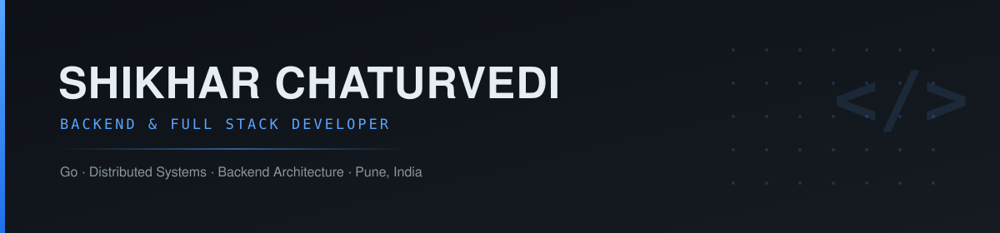

<div align="center">




<a href="https://github.com/SHIKHARCHATURVEDI19"></a>
<a href="https://linkedin.com/in/SHIKHARCHATURVEDI19/"></a>
<a href="https://medium.com/@SHIKHARCHATURVEDI19"></a>
<a href="https://twitter.com/SHIKHARCHATURVEDI19"></a>


</div>


<!--  -->

## About Me

```yaml
name: SHIKHAR CHATURVEDI
role: Software Engineer & Backend Developer
location: India
education: B.Tech Information Technology
graduation: 2028
languages: [C++, JavaScript, TypeScript, Python]
interests: [Backend Development, Data Structures & Algorithms, Full-Stack]
```
> If a design can't survive production traffic, it isn't finished yet.


<!-- <table>
<tr>
<td width="33%" valign="top">

**Focus**

Backend engineering, distributed systems, and concurrency-first Go design.

</td>
<td width="33%" valign="top">

**Currently Building**

Go backend projects that model real production constraints, not tutorials.

</td>
<td width="33%" valign="top">

**Open To**

Backend/SWE internships (2027) and collaboration on Go-based systems.

</td>
</tr>
</table> -->
<!--  -->

<!--
## Currently Building

<table>
<tr>
<td width="50%" valign="top">

<h3 align="center">KodeLeaf</h3>

<p align="center"><i>Developer Analytics Platform</i></p>

<p align="center">


</p>

<br/>

Engineered a full-stack developer analytics platform integrating coding-platform data into a unified dashboard. Architected an asynchronous synchronization pipeline using BullMQ and Redis.

**Core Capabilities**

`Asynchronous pipeline using BullMQ & Redis`
`NextAuth.js with GitHub OAuth`
`Interactive developer visualization`

<p align="center">
<a href="https://github.com/SHIKHARCHATURVEDI19/KodeLeaf"></a>
</p>

</td>
<td width="50%" valign="top">

<h3 align="center">MentorTrack</h3>

<p align="center"><i>Student Performance Tracking Platform</i></p>

<p align="center">


</p>

<br/>

Built and deployed a platform to automatically track coding progress across LeetCode and GitHub. Developed automated daily historical snapshots to track student progress over time.

**Core Capabilities**

`Secure JWT authentication`
`Daily historical snapshots & analytics`
`Hardened REST APIs with Helmet`

<p align="center">
<a href="https://github.com/SHIKHARCHATURVEDI19/MentorTrack"></a>
</p>

</td>
</tr>
</table>


<!-- (existing tech stack table stays here, unchanged) -->

## Tech Stack

<table align="center">
<tr>
<td width="50%" valign="top">

**Languages**


</td>
<td width="50%" valign="top">

**Frontend**


</td>
</tr>
<tr>
<td valign="top">

**Database**


</td>
<td valign="top">

**Tools**


</td>
</tr>
<tr>
<td colspan="2" valign="top">

**Backend**


</td>
</tr>
</table>


## Achievements

<div align="center">


</div>

<br/>

<p align="center">
<i>Solved 500+ Data Structures & Algorithms problems across multiple competitive programming and coding platforms; participated in 46 contests.</i>
</p>

<br/>

### Highlights

- **Finalist – India Innovates 2026**
- **Runner-Up – National Level Unpollute Ideathon**
- **Recognized by Former Union Minister Smriti Irani** for innovation in Smart Waste Management

<br/>


## Competitive Programming

<div align="center">

<a href="https://codeforces.com/profile/SHIKHARCHATURVEDI19"></a>
<a href="https://www.codechef.com/users/SHIKHARCHATURVEDI19"></a>

</div>

<br/>

<table align="center">
<tr>
<td align="center" valign="top" width="50%">


</td>
<td align="center" valign="top" width="50%">

<a href="https://codeforces.com/profile/SHIKHARCHATURVEDI19"></a>

</td>
</tr>
</table>


## GitHub Statistics

<div align="center">

<!--  -->

</div>

<br/>

<table align="center">
<tr>
<td align="center" valign="top" width="33%">


</td>
<td align="center" valign="top" width="33%">


</td>
<td align="center" valign="top" width="33%">


</td>
</tr>
</table>


<div align="center">


### Thanks for stopping by


</div>
