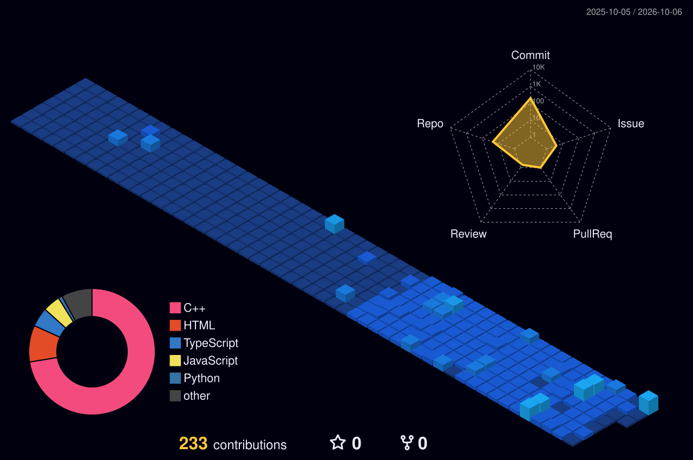

<!-- 🎬 HERO — video intro + name -->

  

<!-- 👩‍💻 LEFT: what I build   •   🏃 RIGHT: life outside code -->

  

<!-- ⚛️ TECH STACK -->

  

<!-- 🪪 DEVELOPER ID + DASHBOARD -->

  

## 🎌 Featured builds

| Project | What it is | Stack | Stars |
|:---|:---|:---|:---:|
| [**Kodeleaf**](https://github.com/SHIKHARCHATURVEDI19/Kodeleaf) | Developer productivity platform with gamification, leaderboards, and performance scoring. | `Next.js` `TypeScript` `PostgreSQL` `Redis` | ⭐ 15 |
| [**MentorTrack**](https://github.com/SHIKHARCHATURVEDI19/MentorTrack) | Mentor-mentee progress tracking via LeetCode & GitHub analytics. | `Node.js` `Express.js` `Supabase` | ⭐ 10 |
| [**ACE Club Platform**](https://github.com/SHIKHARCHATURVEDI19/ACE-Club-Platform) | Club management for events, members, and content. | `Next.js` `TypeScript` `Firebase` | ⭐ 8 |
| [**Amazon ML Challenge**](https://github.com/SHIKHARCHATURVEDI19/Amazon-ML-Challenge) | Memory-efficient entity-matching pipeline for large datasets. | `Python` `Polars` `NumPy` `KNN` | ⭐ 12 |

 

## 🏙️ My contribution city

*Every commit builds another tower — rebuilt automatically every day.*

  

<!-- 💌 LET'S CONNECT -->

  

 

**Always learning, always building.** ✌️

